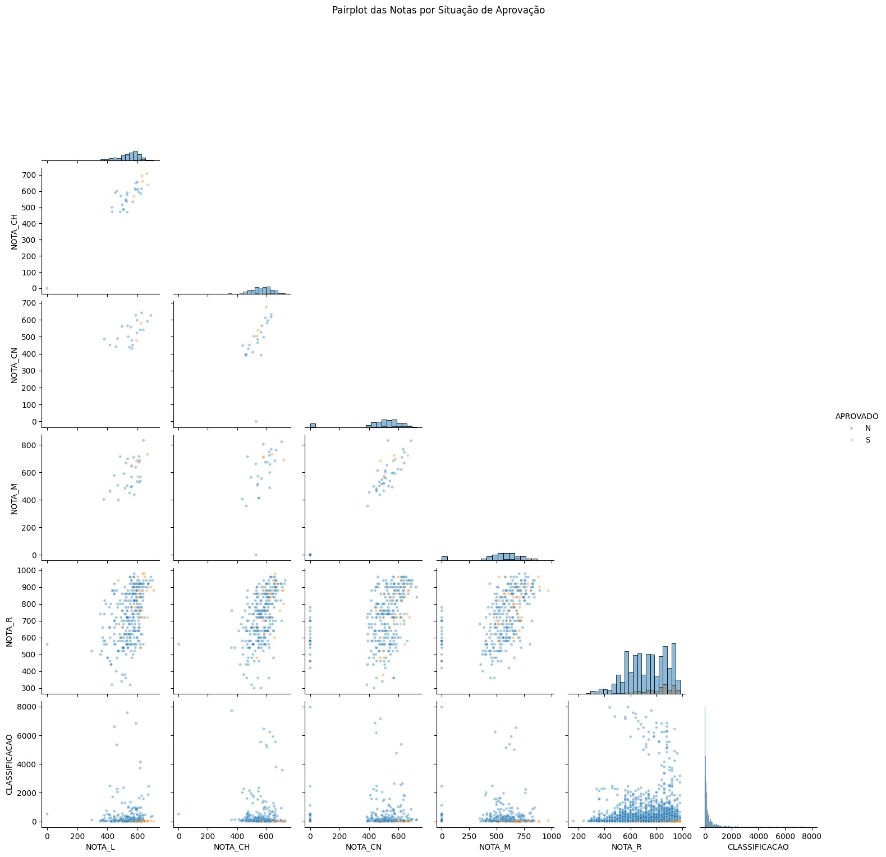
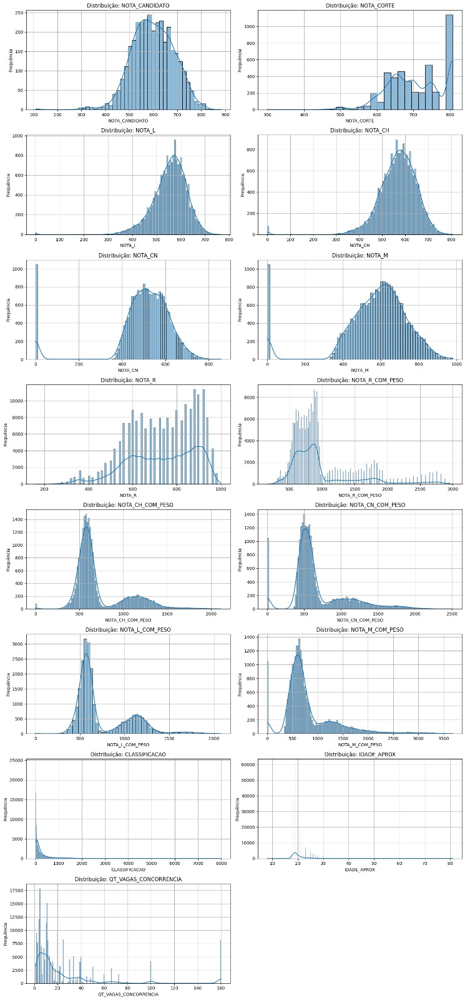
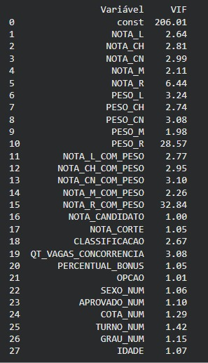

# Conhecendo os dados

Este trabalho tem como objetivo realizar uma 1ª análise exploratória de dados (EDA), a Engenharia de Dados e, em seguida, uma 2ª análise exploratória de dados a partir de um dataset do SISU 2023/1, com foco nos processos de candidatura a vagas no estado de Minas Gerais. A análise busca compreender a estrutura dos dados, identificar padrões, detectar possíveis outliers e analisar relações entre variáveis que influenciam a competitividade dos cursos, fatores que influenciam a nota de corte e a relação entre oferta e competição.

O projeto está inserido no contexto do sistema EduMap, que visa analisar notas de corte e o nível de concorrência em cursos superiores, utilizando técnicas de ciência de dados e aprendizado de máquina.

## 1. Descrição da Base de Dados

A base de dados utilizada foi obtida por meio do portal de dados abertos do Ministério da Educação, contendo informações referentes aos candidatos participantes do SISU em 2023. O conjunto de dados original apresenta mais de um milhão de registros, sendo aplicado, neste trabalho, um recorte específico para o estado de Minas Gerais, totalizando aproximadamente 196 mil registros.

Cada linha representa um candidato participante do processo seletivo, contendo informações como ano e edição do SISU, código e nome da instituição de ensino, curso e turno, notas do candidato, classificação, situação (aprovado, lista de espera, etc.), dentre outras informações.

## 2. Análise Descritiva
### 2.1 Medidas de Tendência Central
Foram utilizadas funções do Pandas para análise estatística descritiva: `df_dataset.describe()`

A partir disso, foi possível observar:
- A média das notas indica o nível geral de desempenho dos candidatos
- A mediana ajuda a entender a distribuição central sem influência de outliers
- Diferenças entre média e mediana sugerem assimetria nos dados
  
### 2.2 Medidas de Dispersão
A análise também considerou:
- Desvio padrão → variabilidade das notas
- Intervalo entre valores mínimos e máximos
- Possíveis dispersões elevadas indicando heterogeneidade dos dados

Essas medidas mostram que há grande variação nas notas e classificações, o que é esperado em processos seletivos amplos como o SISU.

## 3. Análise Visual dos Dados

Foram utilizados gráficos com Matplotlib e Seaborn, incluindo:

### 3.1 Pairplot:
  
  

### 3.2 Pairplot Balanceado:
  
  

#### **Padrões observados no gráfico:**

 - A classe `S` e `N` aparecem em quantidades iguais devido ao balanceamento do gráfico.
 - Em vários pares de notas, os pontos formam um desenho inclinado para cima, indicando relação positiva entre as variáveis comparadas, uma relação direta entre as variáveis, observamos com mais intensidade em Mat. e CN.
 - No KDE da redação é possível observar a distribuição entre as notas dos `S` e dos `N`
 - Mat. E CN definem muito bem a linha entre aprovados e reprovados em uma diagonal ascendentes com pontos bem agrupados.
 - Muitos candidatos com nota zero em CN tiveram boas notas em redação, mas não foram aprovados
 - A relação entre Redação e Mat. Possui muitos pontos espalhados e não tem boa indicação de influência, além de que estar bem misturados os `S` e s `N`.

|Variáveis comparadas|O que se observa?|
|-----|---------|
|NOTA_L x NOTA_R|Formato vertical disperso sem relação muito direta entre `s` e `N` sendo mais sensível na variaçãode NOTA-L.|
|NOTA_CH x NOTA_R|fORMATO VERTICAL sem uma relação direta de grande intensidade entre `s` e `N` na variação das notas nas áreas de conhecimento|
|NOTA_L x NOTA_CH|Temos uma estrutura mais em diagonal ascendentes, porem ainda muito misturados os `s` e `N`|
|NOTA_M × NOTA_CN|Também aparece uma tendência positiva, com pontos bem concentrados e baixa dispersão.|
|NOTA_R × NOTA_M|Os pontos se distribuem em uma faixa ampla, mas ainda com inclinação crescente mas muito misturados.|

#### **Resumo**

Esse pairplot balanceado mostra como as notas se relacionam e nos mostram um caminho claro para a aprovação ou como ter sucesso no modelo atual, onde se concentrar mais nos estudos e ter mais preocupação com os resultados.

A imagem sugere associação positiva entre várias notas e mostra que a aprovação tem distribuição bastante concentrada em valores altos das notas. É uma visualização útil para perceber padrões gerais entre as variáveis, sem ainda tirar conclusões causais.

### 3.3 Boxplots → identificação de outliers

O boxplot é uma ferramenta estatística utilizada para resumir a distribuição de uma variável numérica de forma compacta e visual. Esse tipo de gráfico permite identificar, de maneira eficiente, medidas importantes como a tendência central (representada pela mediana), a dispersão dos dados (por meio do intervalo interquartil – IQR), a assimetria da distribuição (observada pela posição relativa da mediana dentro da caixa) e a presença de valores atípicos (outliers), que são exibidos como pontos fora dos limites dos "bigodes".

Nos gráficos gerados neste projeto, foram analisadas as distribuições das notas dos candidatos sob diferentes perspectivas, incluindo: tipo de concorrência da vaga, grau acadêmico e turno do curso, sexo dos candidatos e situação de aprovação. Além disso, foram realizadas comparações considerando subconjuntos específicos dos dados, como as dez universidades do estado de Minas Gerais com maior número de registros, os dez estados mais representativos e os vinte cursos com maior número de inscritos nesta edição do SISU.

  
  
  
  
  
  
  
  

A partir da análise exploratória dos boxplots, foi possível identificar padrões relevantes e variáveis com potencial influência sobre a concorrência e as notas de corte dos cursos e instituições. Essa etapa foi fundamental para orientar a seleção de atributos mais relevantes, contribuindo diretamente para a construção de modelos de aprendizado de máquina mais robustos e representativos, ao reduzir ruídos e focar em variáveis com maior poder explicativo.

### 3.4 Histogramas → distribuição das notas

  

### 3.5 Mapa de Calor → relação entre variáveis

  

  - Dataset com notas individuais, nota final, classificação e variáveis de contexto. Forte presença de variáveis redundantes.
  - Notas individuais têm alta correlação com NOTA_CANDIDATO (0.75–0.85), indicando forte dependência entre elas.
  - Matemática/CN (0.71) e Linguagens/CH (0.73) formam blocos fortes; Redação tem correlação moderada (0.45–0.52).
  - Classificação depende mais da concorrência (0.76) do que das notas; nota de corte é moderadamente influenciada por notas e vagas.
  - OPCAO tem baixa correlação; PERCENTUAL_BONUS não apresenta correlação válida (NaN).
  - Há forte redundância entre variáveis de desempenho e estrutura clara de dois eixos (quantitativo e verbal).

### 3.6 Variance Inflation Factor (VIF)

  

Todas essas visualizações ajudaram a identificar distribuição assimétrica das notas, detectar valores extremos (outliers) e compreender padrões de concentração de dados.
  
## 4. Detecção de Outliers

A identificação de outliers foi realizada principalmente com:
- Boxplots
- Análise de dispersão

Observações:
- Foram identificados valores extremos em notas e classificações
- Esses valores podem representar candidatos com desempenho muito acima ou abaixo da média
- A presença de outliers pode impactar modelos de machine learning

## 5. Análise de Relações entre Variáveis

Foram analisadas relações entre variáveis utilizando:
- Correlação
- Gráficos de dispersão
- Técnicas estatísticas

Também foram utilizadas técnicas mais avançadas como:
- VIF (Variance Inflation Factor) para multicolinearidade
- Análise com bibliotecas como statsmodels

Principais observações:
- Algumas variáveis apresentam correlação com a nota de corte
- Relações entre classificação e aprovação são evidentes
- Existem dependências entre variáveis relacionadas ao desempenho do candidato

## 6. Trechos de Código Relevantes

Bibliotecas utilizadas:
`import os
import shap
import numpy as np
import pandas as pd
import seaborn as sns
import statsmodels.api as sm
import matplotlib.pyplot as plt`

Modelagem inicial (contexto do projeto):
`from sklearn.svm import SVC
from sklearn.ensemble import RandomForestClassifier
from sklearn.model_selection import train_test_split
from sklearn.calibration import calibration_curve, CalibratedClassifierCV
from sklearn.metrics import f1_score
from sklearn.metrics import classification_report, accuracy_score, confusion_matrix, brier_score_loss, log_loss, balanced_accuracy_score
from sklearn.feature_selection import mutual_info_classif
from sklearn.inspection import permutation_importance
from sklearn.tree import plot_tree`

Chamando o dataset:
`path_local = 'sample_data/SISU_2023.1-MINAS.csv'
path_drive = '/content/drive/MyDrive/SISU_2023.1-MINAS.csv'
if os.path.exists(path_local):
    print(f'O arquivo existe no local padrão!')
    df_dataset = pd.read_csv(path_local, encoding='latin1', sep=';')
elif os.path.exists(path_drive):
    print(f'O arquivo existe no Google Drive!')
    df_dataset = pd.read_csv(path_drive, encoding='latin1', sep=';')
else:
    print('O arquivo NÃO foi encontrado em nenhum dos locais especificados.')
    print('Certifique-se de que o Drive está montado ou o arquivo foi enviado corretamente.')`

Inspeção inicial:
`df_dataset.head()
df_dataset.tail()
print(df_dataset.info())`

## 7. Descrição dos Achados

A partir da análise exploratória, foram identificados os seguintes pontos relevantes:
- Centralidade dos dados: As notas apresentam concentração em uma faixa intermediária, com leve assimetria.
- Dispersão: Existe alta variabilidade nas notas e classificações, indicando diversidade no desempenho dos candidatos.
- Outliers: Foram identificados valores extremos que podem influenciar análises estatísticas e modelos preditivos.
- Correlação entre variáveis:
  - Relação entre nota e classificação (quanto maior a nota, melhor a posição)
  - Variáveis relacionadas ao curso e instituição influenciam a competitividade
  - Algumas correlações são moderadas, indicando influência parcial entre variáveis
- Balanceamento de dados: Observou-se possível desbalanceamento nas classes (ex: aprovados vs não aprovados), o que motivou o uso de técnicas como SMOTE posteriormente.

<!-- Nesta seção, deverá ser registrada uma detalhada análise descritiva e exploratória sobre a base de dados selecionada na Etapa 1 com o objetivo de compreender a estrutura dos dados, detectar eventuais _outliers_ e também, avaliar/detectar as relações existentes entre as variáveis analisadas.

Para isso, sugere-se que sejam utilizados cálculos de medidas de tendência central, como média, mediana e moda, para entender a centralidade dos dados; sejam exploradas medidas de dispersão como desvio padrão e intervalos interquartil para avaliar a variabilidade dos dados; sejam utilizados gráficos descritivos como histogramas e box plots, para representar visualmente as características essenciais dos dados, pois essas visualizações podem facilitar a identificação de padrões e anomalias; sejam analisadas as relações entre as variáveis por meio de análise de correlação, gráficos de dispersões, mapas de calor, entre outras técnicas. 

Inclua nesta seção, gráficos, tabelas, trechos de código e demais artefatos que você considere relevantes para entender os dados com os quais você irá trabalhar.  Além disso, inclua e comente os trechos de código mais relevantes desenvolvidos para realizar suas análises. Na pasta "src", inclua o código fonte completo.

## Descrição dos achados

A partir da análise descrita e exploratória realizada, descreva todos os achados considerados relevantes para o contexto em que o trabalho se insere. Por exemplo: com relação à centralidade dos dados algo chamou a atenção? Foi possível identificar correlação entre os atributos? Que tipo de correlação (forte, fraca, moderada)? -->

## 8. Ferramentas utilizadas
As principais ferramentas utilizadas nesta etapa do projeto estão apresentadas a seguir, acompanhadas de suas características iniciais. Embora existam diversas opções para análise de dados, optou-se pelo uso do ambiente Google Colab, no qual foram empregadas bibliotecas específicas conforme descrito.

Toda a programação foi desenvolvida utilizando a linguagem Python, escolhida por sua versatilidade, simplicidade e alta eficiência. O Python se destaca no contexto de ciência de dados por possuir um amplo ecossistema de bibliotecas científicas, estatísticas e matemáticas desenvolvidas por terceiros, o que amplia significativamente suas capacidades.

A utilização dessas bibliotecas permite a execução de análises mais avançadas, manipulação eficiente de grandes volumes de dados e a construção de visualizações robustas, tornando o Python uma das principais linguagens utilizadas em projetos acadêmicos e profissionais na área de análise de dados.

| Ferramenta | Tipo | Finalidade | Principais Aplicações |
|------------|------|------------|----------------------|
| Matplotlib | Biblioteca base | Criação de gráficos estáticos | Gráficos de linha, barras, histogramas, dispersão |
| Seaborn    | Biblioteca estatística | Visualização avançada e estética | Heatmaps, pairplot, regressão, distribuição |
| Pandas     | Manipulação de dados | Estruturação e análise de dados | DataFrames, leitura de CSV, gráficos rápidos |
| Plotly     | Biblioteca interativa | Gráficos interativos e dashboards | Dashboards, zoom, gráficos dinâmicos |
| Google Colab | Ambiente de execução | Desenvolvimento e execução de código | Análise de dados, visualização e compartilhamento |

## 9. Considerações Finais

A análise exploratória foi essencial para compreender a estrutura do dataset e identificar padrões importantes. Foi possível detectar:
- Variabilidade significativa nos dados
- Presença de outliers
- Relações entre variáveis relevantes para modelagem
Essas descobertas são fundamentais para as próximas etapas do projeto, especialmente na construção de modelos preditivos mais precisos.

<!-- 🐍 Linguagem
Python
📚 Bibliotecas
Pandas: manipulação e análise de dados
NumPy: cálculos numéricos
Matplotlib / Seaborn: visualização de dados
Statsmodels: análise estatística
Scikit-learn: modelagem e machine learning
Imbalanced-learn (SMOTE): balanceamento de classes
SHAP: interpretação de modelos
💻 Ambiente
Google Colab -->

<!-- Nesta seção, deverá ser registrada uma detalhada análise descritiva e exploratória sobre a base de dados selecionada na Etapa 1 com o objetivo de compreender a estrutura dos dados, detectar eventuais _outliers_ e também, avaliar/detectar as relações existentes entre as variáveis analisadas.

Para isso, sugere-se que sejam utilizados cálculos de medidas de tendência central, como média, mediana e moda, para entender a centralidade dos dados; sejam exploradas medidas de dispersão como desvio padrão e intervalos interquartil para avaliar a variabilidade dos dados; sejam utilizados gráficos descritivos como histogramas e box plots, para representar visualmente as características essenciais dos dados, pois essas visualizações podem facilitar a identificação de padrões e anomalias; sejam analisadas as relações entre as variáveis por meio de análise de correlação, gráficos de dispersões, mapas de calor, entre outras técnicas. 

Inclua nesta seção, gráficos, tabelas, trechos de código e demais artefatos que você considere relevantes para entender os dados com os quais você irá trabalhar.  Além disso, inclua e comente os trechos de código mais relevantes desenvolvidos para realizar suas análises. Na pasta "src", inclua o código fonte completo.

## Descrição dos achados

A partir da análise descrita e exploratória realizada, descreva todos os achados considerados relevantes para o contexto em que o trabalho se insere. Por exemplo: com relação à centralidade dos dados algo chamou a atenção? Foi possível identificar correlação entre os atributos? Que tipo de correlação (forte, fraca, moderada)?  -->
