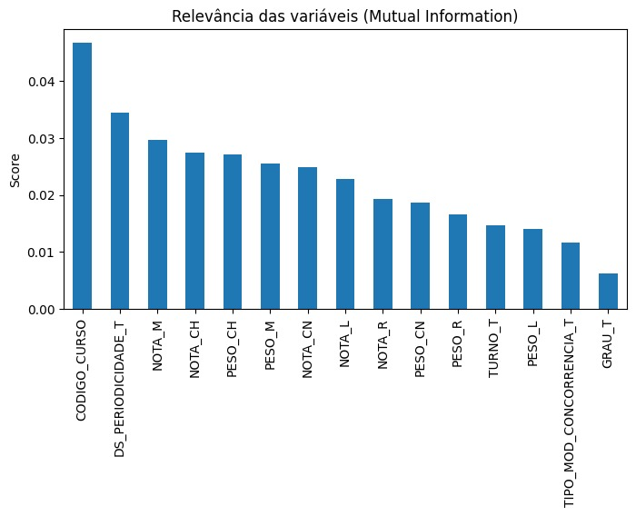

# Preparação dos dados

Esta etapa consistiu na estruturação dos dados do SISU 2023 para o treinamento do modelo Random Forest. As técnicas de pré-processamento e tratamento foram aplicadas conforme as necessidades específicas do projeto, detalhadas a seguir:

- **Feature Engineering e Seleção de Variáveis:** Inicialmente, mapeamos as variáveis preditoras (notas, pesos das provas e dados institucionais do curso) e a nossa variável alvo (`APROVADO_T`)[cite: 4]. Para otimizar o modelo, aplicamos a métrica de *Mutual Information* para calcular a relevância de cada coluna[cite: 4].

    - Ranking de Relevância (Mutual Information):
      
      | Variável | Score |
      | :--- | :--- |
      | CODIGO_CURSO | 0.046804 |
      | DS_PERIODICIDADE_T | 0.034520 |
      | NOTA_M | 0.029729 |
      | NOTA_CH | 0.027505 |
      | PESO_CH | 0.027175 |
      | PESO_M | 0.025580 |
      | NOTA_CN | 0.024956 |
      | NOTA_L | 0.022827 |
      | NOTA_R | 0.019348 |
      | PESO_CN | 0.018738 |
      | PESO_R | 0.016591 |
      | TURNO_T | 0.014665 |
      | PESO_L | 0.014025 |
      | TIPO_MOD_CONCORRENCIA_T | 0.011604 |
      | GRAU_T | 0.006226 |
    
      
    
  Com base nos resultados, o dataset foi filtrado e mantiveram-se apenas as características mais informativas, conforme o código abaixo:
    ```python
    # Seleção das features finais
    features = df_dataset_tratado[[
        'NOTA_L', 'NOTA_CH', 'NOTA_CN', 'NOTA_M', 'NOTA_R',
        'CODIGO_CURSO', 'GRAU_T', 'TIPO_MOD_CONCORRENCIA_T'
    ]]
    ```

- **Separação de Dados:** Os dados foram divididos em conjuntos de treinamento (80%) e teste (20%). Como foi identificado que a base de dados é altamente desbalanceada (90,2% pertencentes à classe 0 - Reprovado; e apenas 9,8% à classe 1 - Aprovado), utilizou-se o parâmetro de estratificação (stratify=target). Isso assegurou que a proporção das classes fosse preservada de maneira adequada em ambos os conjuntos.  

  | Conjunto    | Classe 0 (Reprovado) | Classe 1 (Aprovado) | % Classe 0 | % Classe 1 |
  |-------------|----------------------|---------------------|------------|------------|
  | y_train     | 132.457              | 14.375              | 90,21%     | 9,79%      |
  | y_test      | 33.115               | 3.594               | 90,21%     | 9,79%      |

- **Transformação e Normalização de Dados:** Optou-se por não realizar a normalização ou padronização dos dados (como Min-Max Scaling ou StandardScaler). Essa etapa foi dispensada porque o algoritmo escolhido, o Random Forest Classifier, é baseado em árvores de decisão e, portanto, não é sensível à magnitude ou à escala das variáveis matemáticas.  

- **Tratamento de Dados Desbalanceados:** Para contornar a discrepância severa de volume entre as classes, foi configurado o hiperparâmetro class_weight='balanced_subsample' diretamente no modelo, o que ajuda a ajustar os pesos das classes automaticamente durante o treinamento. Vale registrar que a técnica de oversampling SMOTE chegou a ser aplicada na fase de testes, mas o modelo base se mostrou superior por manter uma melhor estabilidade geral e gerar predições mais confiáveis, justificando a não utilização do balanceamento sintético na versão final. 

<!-- Algumas das etapas podem estar relacionadas à:

* Limpeza de Dados: trate valores ausentes: decida como lidar com dados faltantes, seja removendo linhas, preenchendo com médias, medianas ou usando métodos mais avançados; remova _outliers_: identifique e trate valores que se desviam significativamente da maioria dos dados.

* Transformação de Dados: normalize/padronize: torne os dados comparáveis, normalizando ou padronizando os valores para uma escala específica; codifique variáveis categóricas: converta variáveis categóricas em uma forma numérica, usando técnicas como _one-hot encoding_.

* _Feature Engineering_: crie novos atributos que possam ser mais informativos para o modelo; selecione características relevantes e descarte as menos importantes.

* Tratamento de dados desbalanceados: se as classes de interesse forem desbalanceadas, considere técnicas como _oversampling_, _undersampling_ ou o uso de algoritmos que lidam naturalmente com desbalanceamento.

* Separação de dados: divida os dados em conjuntos de treinamento, validação e teste para avaliar o desempenho do modelo de maneira adequada.
  
* Manuseio de Dados Temporais: se lidar com dados temporais, considere a ordenação adequada e técnicas específicas para esse tipo de dado.
  
* Redução de Dimensionalidade: aplique técnicas como PCA (Análise de Componentes Principais) se a dimensionalidade dos dados for muito alta.

* Validação Cruzada: utilize validação cruzada para avaliar o desempenho do modelo de forma mais robusta.

* Monitoramento Contínuo: atualize e adapte o pré-processamento conforme necessário ao longo do tempo, especialmente se os dados ou as condições do problema mudarem.

* Entre outras....

Avalie quais etapas são importantes para o contexto dos dados que você está trabalhando, pois a qualidade dos dados e a eficácia do pré-processamento desempenham um papel fundamental no sucesso de modelo(s) de aprendizado de máquina. É importante entender o contexto do problema e ajustar as etapas de preparação de dados de acordo com as necessidades específicas de cada projeto.-->

# Descrição do modelo
## Escolha do Algoritmo
Para a resolução do problema da classificação da aprovação de candidados no SISU 2023, foi utilizado o algoritmo Random Forest, pertencente à família de métodos de aprendizado supervisionado baseados em ensemble. 

## Justificativa da Escolha
A escolha do Random Forest se deu por sua adequação às características do conjunto de dados ao tipo de problema abordado. O dataset apresenta
* grande volume de registros
* predominância de variáveis numéricas
* possíveis relações não lineares entre os atributos

Diante disso, o Random Forest se destaca por:
* capturar relações complexas sem necessidade de transformações avançadas
* apresenta alta robustez a ruídos e outliers
* reduz o risco de overfiting em comparação a árvores de decisão (quando usadas de maneira isolada)
* permite a análise da importância das variáveis

Além disso, o problema apresenta desbalanceamento entre as classes (aprovados e não aprovados), o que reforça a escolha de um modelo que permita ajustes específicos para lidar com essa característica.

**Nesta seção, conhecendo os dados e de posse dos dados preparados, é hora de descrever o algoritmo de aprendizado de máquina selecionado para a construção do modelo proposto. Inclua informações abrangentes sobre o algoritmo implementado, aborde conceitos fundamentais, princípios de funcionamento, vantagens/limitações e justifique a escolha do algoritmo utilizado.**

Explore aspectos específicos, como o ajuste dos parâmetros livres do algoritmo. Lembre-se de experimentar parâmetros diferentes e principalmente, de registrar os testes realizados com diferentes parâmetros que servirão para justificar as escolhas realizadas.

# Avaliação dos modelos criados

## Métricas utilizadas

## Configuração do Modelo e Parâmetros

| Parâmetro | Valor | Descrição |
| :--- | :--- | :--- |
| `n_estimators` | 800 | Quantidade de árvores na floresta. |
| `criterion` | **entropy** | Critério de avaliação das divisões. |
| `max_depth` | **None** | Expansão máxima das árvores. |
| `min_samples_split` | 5 | Mínimo de amostras para dividir um nó. |
| `min_samples_leaf` | 2 | Mínimo de amostras em um nó folha. |
| `class_weight` | `balanced_subsample` | Tratamento de desbalanceamento de classes. |
| `random_state` | 42 | Garantia de reprodutibilidade. |

> **Nota Técnica:** Foi adotado um limiar de decisão (**threshold**) de **0.35**, otimizando o equilíbrio entre *precision* e *recall* para a classe minoritária (candidatos aprovados).


  O modelo Random Forest foi configurado com 800 árvores (**_n_estimators=800_**), utilizando o critério **_entropy_** para avaliação das divisões. Não foi definida profundidade máxima para as árvores (**_max_depth=None_**), permitindo maior capacidade de aprendizado. 
  
  Os parâmetros **_min_samples_split=5_** e **_min_samples_leaf=2_** foram utilizados para reduzir divisões excessivas e melhorar a generalização do modelo. Além disso, foi aplicado **_class_weight='balanced_subsample'_** para auxiliar no tratamento do desbalanceamento entre as classes.
  
  O parâmetro **_ramdom_state=42_** foi definido para garantir reprodutibilidade dos resultados.

  Foi realizado ajuste do limiar de decisão (**_threshold_**) aplicado às probabilidades previstas pelo modelo. Foi adotado o limiar de **0.35**, buscando melhorar o equilíbrio entre o _precision_ e _recall_, especialmente na  identificação da classe minoritária (_candidatos aprovados_).

  ## Resultados

### Relatório de Classificação
| Classe | Precision | Recall | F1-Score |
| :--- | :---: | :---: | :---: |
| **0 (Não Aprovados)** | 96% | 95% | 95% |
| **1 (Aprovados)** | 55% | 61% | 58% |

### Análise
*   **Classe de Aprovados (1):** O modelo alcançou um *recall* de 61%, o que é fundamental neste contexto, pois indica uma boa sensibilidade para identificar candidatos aprovados, reduzindo falsos negativos.
*   **Validação Cruzada (k-fold):** Média de **76,11%** (F1-weighted), demonstrando estabilidade, apesar das variações naturais entre os subconjuntos de dados.

  O modelo apresentou **acurácia geral de 91%** na classificação dos candidatos. Para a classe de **não aprovados (0)**, foram obtidos **_precision_ de 96%, _recall_ de 95% e _F1-score_ de 95%. Já para a classe de **aprovados (1)**, o modelo alcançou _precision_ de 55%, _recall_ de 61% e _F1-score_ de 58%.

  Os resultados demonstram **bom desempenho geral e maior equilíbrio** na identificação da classe minoritária, indicando melhora na capacidade do modelo em reconhecer.

## Discussão dos resultados obtidos

  Os resultados obtidos demonstram que o modelo Random Forest apresentou bom desempenho na tarefa de classificação da aprovação dos candidatos. A acurácia geral indica alta taxa de acertos nas previsões realizadas pelo modelo.

  Entretanto, considerando o desbalanceamento existente entre as classes, a análise não pode ser feita apenas com base na acurácia. Por este motivo, métricas como _precision_, _recall_ e _F1-score_ foram auxiliadoras para avaliar de forma mais adequada a qualidade do modelo.

  ### Desempenho por Classe

  Para a classe de **não aprovados (0)**, o modelo apresentou desempenho elevado em todas as métricas, demonstrando grande capacidade de identificar candidatos não aprovados.

  Sobre a classe de **aprovados (1)**, os resultados medianos, com _precision_ de 55%, _recall_ de 61% e _F1-score_ de 58%. O valor do _recall_ indica que o modelo conseguiu identificar uma parcela significativa dos candidados, de fato, aprovados, reduzindo a quantidade de falsos negativos. Esse aspecto é importante no contexto do problema, pois demonstra a sensibilidade do modelo à classe minoritária. 

  O ajuste do limiar de decisão também contribuiu para melhorar o equilíbrio entre as métricas, permitindo aumentar a capacidade do modelo em reconhecer candidados aprovados, mesmo com um impacto moderado na precisão das previsões positivas.
  
  
### Validação Cruzada (k-fold)

  Na validação cruzada (**_k-fold_**), foram obtidos resultados de aproximadamente **76,22%, 76,71%, 64,79%, 76,19% e 86,64%**, resultando em média de **76,11%**. Os resultados demonstram desempenho moderado entre os _folds_, embora ainda exista variação entre algumas divisões dos dados. A queda observada em determinados _folds_ pode estar relacionada ao desbalanceamento das classes e à dificuldade do modelo em igualar todos os subconjuntos avaliados. A utilização da métrica **_F1_weighted_** permitiu considerar o desempenho global do modelo levando em conta a proporção das classes no conjunto de dados, proporcionando uma avaliação mais equilibrada em relação ao desbalanceamento existente.
  

### Calibração

Ainda para melhorar a confiança das probabilidades previstas no modelo, foram aplicadas técnicas de calibração utilizando os métodos _sigmoid_ e _isotonic_. A avaliação foi realizada por meio de _Brier Score_, no qual valores menores indidcam melhor calibração das probabilidades. Os resultados mostraram que o método _isotonic_ apresentou melhor desempenho, com _Brier Score_ de aproximadamente **0,0550**, superior ao modelo base e ao método _sigmoid_. De forma geral, a calibração contribuiu para tornar as probabilidades mais consistentes com os resultados reais observados.

- **Curva de Calibração - Classe 0**
  

- **Curva de Calibração - Classe 1**
  
  

### Matriz de Confusão

 A **Matriz de Confusão** permite a visualização mais detalhada entre erros e acertos do modelo na classificação dos candidatos. O modelo obteve **31.319** verdadeiros negativos, classificando corretamente candidatos não aprovados, e **2.202** verdadeiros positivos, identificando corretamente candidados aprovados. Também foram observados **1.796** falsos positivos, correspondentes a candidados classificados como aprovados quando não eram, e **1.392** falsos negativos, referentes a candidatos aprovados que não foram identificados corretamente pelo modelo. Com base nesses resultados, o modelo apresentou **acurácia de 91%**, **precisão de 55%** para a classe de aprovados e **recall de 61%**, indicando desempenho satisfatório e maior equilibrio na identificação da classe minoritária.
  
  - **Matriz de Confusão (gráfico)**
  

### Matriz de Confusão Normalizada

  Na **Matriz de Confusão Normalizada** foi possível analisar o desempenho proporcional do modelo de cada classe. Para a classe de **não aprovados (0)**, o modelo classificou corretamente aproximadamente **95%** dos candidatos, enquanto cerca de **5%** foram classificados incorretamente como aprovados. Já para a classe de **aprovados (1)**, o modelo identificou corretamente aproximadamente **61%** dos candidados, enquanto cerca de **39%** não foram reconhecidos corretamente, sendo classificados como **não aprovados**. Os resultados demonstram que o modelo apresentou alto desempenho na identificação da classe maior e desempenho moderadamente satisfatório para a classe minoritária, indicando melhora na capacidade de reconhecer candidados aprovados.

  - **Matriz de Confusão Normalizada (gráfico)**
    
    

### Visualização da Árvore de Decisão

  A estrutura da **Árvore de Decisão** permitiu visualizar como o modelo realiza as classificações com base nas variáveis disponíveis. No **nó raiz**, a variável _NOTA_M_ aparece como principal critério de divisão, indicando que a nota de Matemática é um dos fatores mais relevantes para a classificação inicial dos candidatos. A partir dessa divisão, o modelo utiliza outras variáveis para refinar as decisões ao longo da árvore. Entre as variáveis com mais destaque estão _CODIGO_CURSO_, _GRAU_T_, _NOTA_CH_ e _NOTA_R_, demonstrando que tanto o desempenho acadêmico quando características relacionadas ao curso influenciam a previsão final do modelo. A **análise da entropia** mostrou que os nós mais profundos apresentam valores menores, indicando maior pureza nas classificações e aumento da confiança do modelo nas decisões tomadas em cada caminho da árvore. Além disso, as cores presentes facilitam a interpretação das classes predominantes em cada nó, permitindo identificar regiões com maior tendência à classificação como aprovados ou não aprovados. Por fim, destaca-se que a árvore apresentada na imagem representa apenas uma das árvores utilizadas pelo modelo, sendo o resultado final do modelo basedo em combinações de múltiplas árvores de decisão.


### Importância das Variáveis (Feature Importance)

  Na análise de **Importância das Variáveis (_Feature Importance_)** foi utilizada para identificar quais variáveis exerceram maior influência nas decisões do modelo. Os resultados demonstraram qua a variável **CODIGO_CURSO** apresentou a maior importância no processo de classificação, indicando forte relação entre o curso escolhido e a probabilidade de aprovação dos candidatos. Em seguida, destacaram-se as variáveis relacionadas ao desempenho dos candidados (_notas_), principalmente:
  - **NOTA_M**
  - **NOTA_CH**
  - **NOTA_CN**
  - **NOTA_L**
  - **NOTA_R**
    
Logo, reforça que o desempenho nas provas é importante na previsão da aprovação.

Ainda falando sobre a Importância das Variáveis, **GRAU_T** e **TIPO_MOD_CONCORRENCIA_T** apresentam menor influência, contrubuindo de forma complementar para a classificação, mas não sendo o alvo principal no quesito **aprovação**. De forma geral, a análise evidencia que tanto fatores acadêmicos quando características relacionadas ao curso exercem impacto na previsão realizada pelo modelo.

- **Gráfico: Importância das Variáveis**
  
  
    
### Permutation Importance por Classe
  A análise de **Permutation Importance por Classe** permitiu avaliar o impacto individual das variáveis no desempenho do modelo para cada classe analisada, considerando o F1-score como metrica principal. Os resultados mostraram que **_CODIGO_CURSO_** foi a variável de maior importância em ambas as classes, indicando forte influência do curso escolhido na previsão realizada pelo modelo. A remoção dessa variável provocou a maior queda no desempenho, especialmente na **Classe 1**. Para a **Classe 0**, observou-se maior influência das variáveis **_GRAU_T_**, **_NOTA_M_** e **_NOTA_R_**, enquanto variáveis como **_NOTA_CN_** e **_NOTA_L_** apresentam impacto reduzido no desempenho do modelo. Para a **Classe 1**, o modelo demonstrou maior dependência das notas acadêmicas, principalmente **_NOTA_M_** e **_NOTA_R_**, indicando que Matemática e Redação possuem forte relação com a identificação dessa classe. Além disso, as demais áreas do conhecimento também apresentam contribuição relevante para a classificação. A variável **_TIPO_MOD_CONCORRENCIA_T** apresentou baixa importância em ambas as classes, sugerindo influência reduzida na capacidade preditiva do modelo quando comparada às variáveis acadêmicas e às características do curso. De forma geral, os resultados indicam que o modelo utiliza padrões distintos para identificar cada classe, atribuindo pesos diferentes às variáveis conforme perfil analisado.

- **Permutation Importance - Classe 0 (gráfico)**
  

- **Permutation Importance - Classe 1 (gráfico)**
  


# Pipeline de pesquisa e análise de dados

Em pesquisa e experimentação em sistemas de informação, um pipeline de pesquisa e análise de dados refere-se a um conjunto organizado de processos e etapas que um profissional segue para realizar a coleta, preparação, análise e interpretação de dados durante a fase de pesquisa e desenvolvimento de modelos. Esse pipeline é essencial para extrair _insights_ significativos, entender a natureza dos dados e, construir modelos de aprendizado de máquina eficazes. 

## Observações importantes

Todas as tarefas realizadas nesta etapa deverão ser registradas em formato de texto junto com suas explicações de forma a apresentar os códigos desenvolvidos e também, o código deverá ser incluído, na íntegra, na pasta "src".
